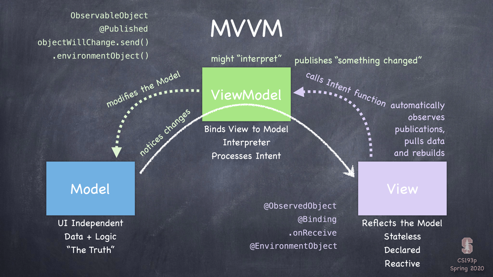

# Lecture 2: MVVM and the Swift Type System

- [1. MVVM (Model - View - ViewModel)](#1-mvvm-model---view---viewmodel)
- [2. Varieties of Types](#2-varieties-of-types)
  - [2.1. `struct` and `class`](#21-struct-and-class)
  - [2.2. Generics](#22-generics)
  - [2.3. Functions as Types](#23-functions-as-types)

## 1. MVVM (Model - View - ViewModel)

- A "code organizing" architectural design paradigm.
- Works in concert with the concept of "reactive" user-interfaces.
- Must be adhered to for SwiftUI to work.
- It is different from MVC (Model - View - Controller) that UIKit (old-style iOS) uses.

<p align="center">
  
</p>

## 2. Varieties of Types

- `struct`
- `class`
- `protocol`
- "Don't Care" type (aka generics)
- `enum`
- functions

### 2.1. `struct` and `class`

- Both `struct` and `class` have:

  - pretty much exactly the same syntax.
  - stored `var`s (stored in memory)
  - computed `var`s (whose value is the result of evaluating some code)
  - constant `let`s (whose value never change)
  - `func`tions
  - `init`ializers (special functions that are called when creating a `struct` or `class`)

- Differences between `struct` and `class`

  | `struct`                                                                          | `class`                                                                                    |
  | --------------------------------------------------------------------------------- | ------------------------------------------------------------------------------------------ |
  | Value Type                                                                        | Reference type                                                                             |
  | _Copied_ when passed or assigned                                                  | Passed around via _pointers_                                                               |
  | Copy on write                                                                     | Automatically reference counted                                                            |
  | Functional programming                                                            | Object-oriented programming                                                                |
  | No inheritance                                                                    | Inheritance (single)                                                                       |
  | "Free" `init` initializes _ALL_ `var`s                                            | "Free" `init` initializes _NO_ `var`s                                                      |
  | Mutability must be explicitly stated                                              | Always mutable                                                                             |
  | Your "go to" data structure                                                       | Used in specific circumstances                                                             |
  | Everything you've seen so far is a `struct` (except `View` which is a `protocol`) | The `ViewModel` in MVVM is always a `class` (also, UIKit (old style iOS) is `class`-based) |

### 2.2. Generics

```swift
struct Array<Element> {
    ...
    func append(_ element: Element) { ... }
}
```

- The type of the argument to `append` is `Element`. A “don’t care” type.
- Array’s implementation of `append` knows nothing about that argument and it does not care.
- `Element` is not any known struct or class or protocol, it’s just a placeholder for a type.

### 2.3. Functions as Types

- Examples:

  ```swift
  (Int, Int) -> Bool   // takes two `Int`s and returns a `Bool`
  (Double) -> Void     // takes a `Double` and returns nothing
  () -> Array<String>  // takes no arguments and returns an `Array` of `String`s
  () -> Void           // takes no arguments and returns nothing
  ```

  All of the above are just types. No different than `Bool` or `View` or `Array<Int>`.

  ```swift
  var foo: (Double) -> Void  // `foo`'s type: function that takes a `Double`, returns nothing
  func doSomething(what: () -> Bool)  // `what`'s type: function takes nothing, returns `Bool`
  ```

- Closures
